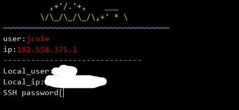

# Shelly not finished (7-30-23)
#-EZ reverse shell script
## before attack you will need
- ip
- remote username
- SSH password

## example commenads
`python main.py --user dan --ip 10.0.0.1`
---

## Disclaimer

This script is for educational and testing purposes only. Do not use it for illegal activities or to harm others. The creators of this script are not responsible for any misuse or damage caused by it.
